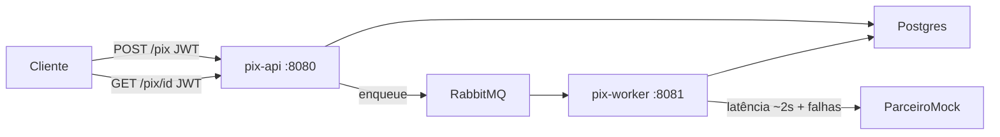

# PIX Async API

[](https://github.com/lycan-nt/bulla-pix/actions/workflows/ci.yml)

Solução assíncrona de processamento de PIX.

Monorepo Maven com dois serviços e uma biblioteca compartilhada:

| Módulo | Tipo | Responsabilidade |
|--------|------|------------------|
| **pix-api** | Serviço (`:8080`) | Recebe a solicitação, autentica, persiste, enfileira e consulta status |
| **pix-worker** | Serviço (`:8081`) | Consome a fila, chama o parceiro (mock) e atualiza o status |
| **pix-core** | Biblioteca JAR | Domínio, casos de uso, persistência e topologia da fila |

> `pix-core` **não** é um terceiro microsserviço: vira JAR e é embutido nos dois apps na build.

## Visão geral

1. O cliente obtém um JWT e chama `POST /pix`.
2. O **pix-api** valida, persiste a transação (`RECEIVED`), enfileira o `transactionId` e responde **202 Accepted** — sem esperar a instituição financeira (~2s).
3. O **pix-worker** consome a fila, processa com o mock do parceiro e atualiza o status (`PROCESSING` → `COMPLETED` ou `FAILED`).
4. O cliente consulta o resultado com `GET /pix/{transactionId}`.

## Arquitetura



### Como o `pix-core` entra na build

1. O Maven gera `pix-core/target/pix-core-*.jar`.
2. `pix-api` e `pix-worker` dependem de `com.bullla:pix-core`.
3. No fat JAR de cada app, o core fica em `BOOT-INF/lib/`.
4. No Docker Compose sobem apenas **pix-api**, **pix-worker**, Postgres e RabbitMQ.

## Stack

- Java 21, Spring Boot 3.4
- PostgreSQL, RabbitMQ
- Spring Security (JWT HS256) — somente no **pix-api**
- Resilience4j (circuit breaker) — somente no **pix-worker**
- springdoc OpenAPI, Actuator e Prometheus
- Pacote base: `com.bullla.pix`

## Como executar

No diretório deste repositório:

```bash
docker compose up --build
```

Sobe:

- **pix-api** → http://localhost:8080  
- **pix-worker** (health) → http://localhost:8081  
- Postgres → `:5432`  
- RabbitMQ UI → http://localhost:15672 (`pix` / `pix`)

## Autenticação (somente demonstração)

JWT de demonstração — **não usar em produção**.

```bash
TOKEN=$(curl -s -X POST http://localhost:8080/auth/token \
  -H 'Content-Type: application/json' \
  -d '{"username":"demo","password":"demo"}' | jq -r .accessToken)
```

Credenciais padrão: usuário `demo`, senha `demo`.

## Exemplos da API

```bash
# Solicitar PIX
curl -s -X POST http://localhost:8080/pix \
  -H "Authorization: Bearer $TOKEN" \
  -H 'Content-Type: application/json' \
  -d '{
    "transactionId": "tx-123456",
    "amount": 150.75,
    "pixKey": "cliente@email.com",
    "description": "Pagamento de fatura"
  }'

# Consultar status
curl -s http://localhost:8080/pix/tx-123456 \
  -H "Authorization: Bearer $TOKEN"
```

Links úteis:

- Swagger: http://localhost:8080/swagger-ui.html  
- Health da API: http://localhost:8080/actuator/health  
- Health do worker: http://localhost:8081/actuator/health  

## Testes

```bash
export JAVA_HOME=$(/usr/libexec/java_home -v 21)
mvn clean test
```

## CI/CD

Pipeline no GitHub Actions ([`.github/workflows/ci.yml`](.github/workflows/ci.yml)), disparado em todo `push`/`pull request` para `main`/`master`:

| Job | O que faz |
|-----|-----------|
| **Testes e build Maven** | `mvn -B clean verify` — compila os 3 módulos (`pix-core`, `pix-api`, `pix-worker`) e roda os testes unitários |
| **Build das imagens Docker** | Builda `pix-api/Dockerfile` e `pix-worker/Dockerfile`, garantindo que os artefatos sobem em container; só roda se o job de testes passar |

Assim, nenhum merge chega à `main` sem compilar, passar nos testes e buildar as imagens.

## Premissas

- A instituição financeira é **simulada** no worker (latência ~2s e taxa de falha configuráveis).
- O `transactionId` é a chave de idempotência enviada pelo cliente.
- Mesmo `transactionId` com o mesmo payload → retorna a transação existente.
- Mesmo `transactionId` com payload diferente → **409 Conflict**.
- Status: `RECEIVED` → `PROCESSING` → `COMPLETED` | `FAILED`.
- Autenticação JWT é mínima (demo), suficiente para proteger `/pix/**` no teste.

## Documentação complementar

| Documento | Conteúdo |
|-----------|----------|
| [docs/DECISOES.md](docs/DECISOES.md) | Gargalos, decisões, trade-offs e alto volume |
| [docs/OPERACAO.md](docs/OPERACAO.md) | Observabilidade, falhas, recuperação e escala |
| [.github/workflows/ci.yml](.github/workflows/ci.yml) | Pipeline de CI: testes + build das imagens Docker |
