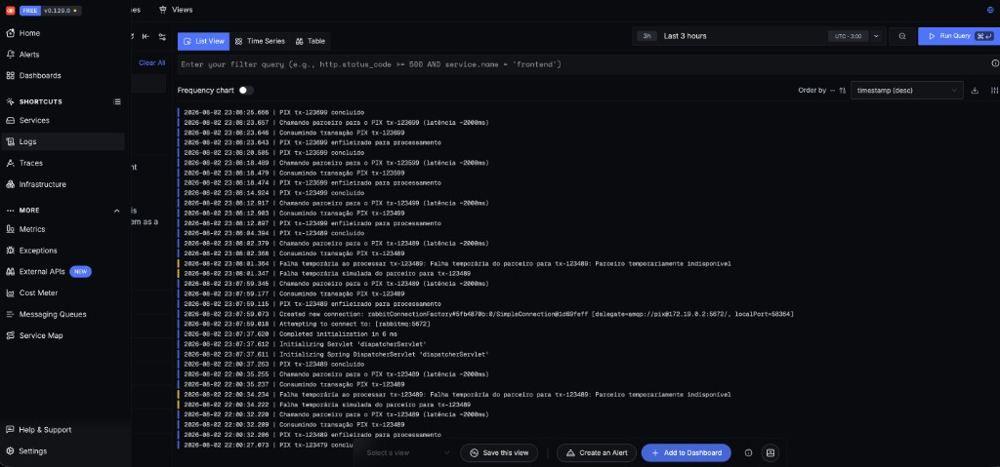
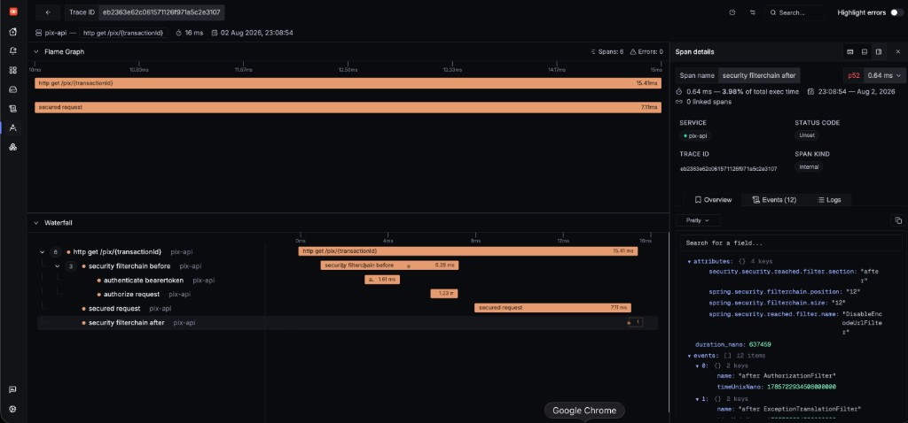
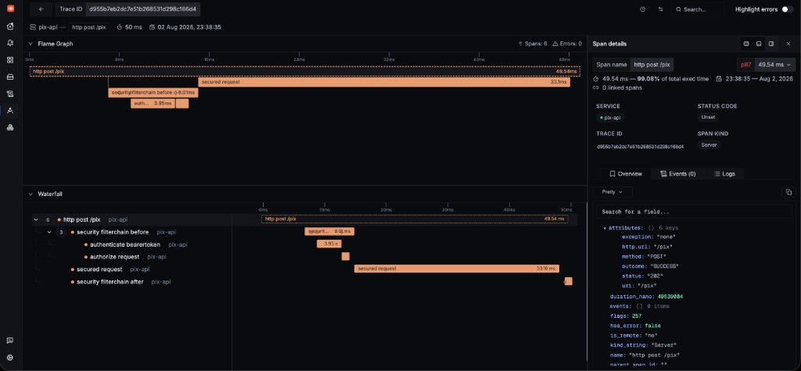
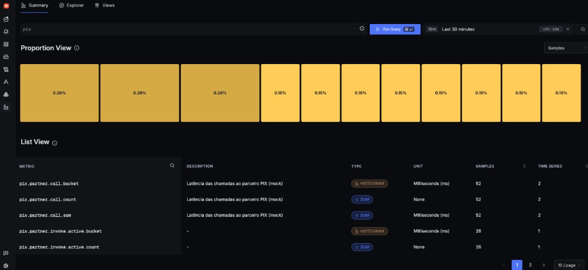

# Operação

## Observabilidade e monitoramento

- **Correlation ID ponta a ponta**: o `pix-api` gera/propaga `correlationId` (header `X-Correlation-Id`, MDC nos logs). Ao publicar na fila, o `correlationId` viaja como header AMQP (`PixMessagingTopology.CORRELATION_ID_HEADER`) e o `pix-worker` o recoloca no MDC ao consumir — junto com o `transactionId` da mensagem. Assim um único `correlationId` conecta o log do `POST /pix` ao log do processamento no worker, mesmo em serviços/processos diferentes. Complementa (não substitui) o trace distribuído do SigNoz abaixo — é o identificador "amigável" que também aparece nos logs.
- **Actuator** no **pix-api** (`:8080`) e no **pix-worker** (`:8081`): `/actuator/health`, `/actuator/metrics`, `/actuator/prometheus`. No **pix-worker**, também `/actuator/circuitbreakers` e `/actuator/circuitbreakerevents` (Resilience4j).
- **Métricas de negócio** (Micrometer, expostas em `/actuator/prometheus` no **pix-worker** e também via OTLP no SigNoz — lá aparecem com nome em notação de ponto):
  - `pix_transactions_result_total{status="completed|failed"}` (`pix.transactions.result` no SigNoz) — contagem de transações por status final.
  - `pix_transactions_retry_total` (`pix.transactions.retry`) — quantas vezes uma transação foi reagendada após falha temporária do parceiro.
  - `pix_partner_call_seconds{outcome="success|failure"}` (`pix.partner.call`) — latência (count/sum/max) de cada chamada ao parceiro mock, já segmentada por resultado.
- **Health do circuit breaker**: `management.health.circuitbreakers.enabled=true` no **pix-worker** inclui o estado do circuit breaker `partnerPix` (`CLOSED`/`OPEN`/`HALF_OPEN`) em `/actuator/health`, sem precisar consultar métricas manualmente.
- Pontos úteis de acompanhamento: taxa de `POST` (métrica padrão `http_server_requests_seconds` no **pix-api**), distribuição de status (`pix_transactions_result_total`), falhas do parceiro (`pix_partner_call_seconds{outcome="failure"}` e estado do circuit breaker) e lag da fila (UI do RabbitMQ).

## Observabilidade (SigNoz)

Além do Actuator/Prometheus acima, o `docker compose up` sobe uma stack [SigNoz](https://signoz.io)
self-hosted (ClickHouse + OTel Collector + UI, vendorizada em
[`observability/signoz`](../observability/signoz)) que centraliza **traces, métricas e logs**
dos dois serviços em uma única UI, com correlação automática entre eles.

### Acesso

1. `docker compose up --build` (primeiro boot demora ~1-2 min: ClickHouse precisa rodar as
   migrations de schema antes do collector aceitar dados).
2. Abrir http://localhost:3301 e logar com a conta admin pré-provisionada — sem passo manual de
   signup: `admin@pix.local` / `Pix-Admin-Bulla1!` (variáveis `SIGNOZ_USER_ROOT_*` em
   `docker-compose.signoz.yml`, credenciais de demo, iguais em espírito ao `pix`/`pix` do RabbitMQ).
3. Gerar tráfego (`POST /pix` + `GET /pix/{id}`, ver exemplos no [README](../README.md)) e explorar
   em **Traces**, **Logs** e **Dashboards → Metrics** no menu lateral.

*Aba **Logs** do SigNoz: eventos do `pix-api` e `pix-worker` já correlacionados (enfileiramento,
consumo, chamada ao parceiro mock e falhas temporárias com retry) — pesquisável por
`transactionId` para acompanhar uma transação específica nos dois serviços.*

### O que é exportado e como

- **Traces**: `pix-api` e `pix-worker` exportam via OTLP (`micrometer-tracing-bridge-otel` +
  `opentelemetry-exporter-otlp`) para `otel-collector:4318`. O contexto de trace propaga
  automaticamente do `POST /pix` até o processamento no worker através do header AMQP
  (`spring.rabbitmq.template.observation-enabled` / `listener.simple.observation-enabled`),
  então uma única trace no SigNoz mostra a requisição HTTP, a publicação na fila, o consumo
  no worker e a chamada ao parceiro mock como spans filhos — incluindo o span
  `pix.partner.invoke` (~2s), que isola visualmente a latência do parceiro na waterfall.

  

  *Aba **Traces** do SigNoz: detalhe (Flame Graph + Waterfall) de uma trace do
  `GET /pix/{transactionId}`, com a instrumentação automática do Spring detalhando cada span
  da filter chain de segurança (`security filterchain before/after`, `authenticate bearertoken`,
  `authorize request`) — no painel à direita dá pra inspecionar atributos e logs de cada span
  individualmente.*

  

  *Outra trace, agora de um `POST /pix` (~50ms, status 202): repare que ela **não** tem o span
  `pix.exchange/pix.transaction send` nem spans do `pix-worker` — isso acontece porque essa
  chamada reenviou o mesmo `transactionId` de uma transação já existente, e o
  `CreatePixTransactionUseCase` retorna a transação existente sem publicar de novo na fila
  (idempotência). Numa trace de `POST /pix` para um `transactionId` novo, o mesmo trace_id
  encadeia adicionalmente o span de publicação na fila e, do lado do **pix-worker**, o
  `pix.transactions receive` com o `pix.partner.invoke` (~2s) como filho — confirmado via
  consulta direta ao ClickHouse (`signoz_traces.distributed_signoz_index_v3`).*
- **Métricas**: `micrometer-registry-otlp` publica periodicamente todos os meters (as métricas
  de negócio da seção anterior + métricas padrão do Spring: `http.server.requests`,
  `rabbitmq.*`, JVM, etc.) para o mesmo collector.

  

  *Aba **Metrics** do SigNoz: métricas de negócio exportadas via OTLP, incluindo a latência do
  parceiro (`pix.partner.call`, em histograma) e a métrica automática gerada pela `Observation`
  do span `pix.partner.invoke`.*
- **Logs**: um `OpenTelemetryAppender` (Logback) instalado em runtime
  (`OpenTelemetryAppenderInitializer`) envia cada log via OTLP já com `trace_id`/`span_id` e
  todo o MDC (`correlationId`, `transactionId`) como atributos — em **Logs** no SigNoz é
  possível filtrar por `transactionId` e ver exatamente os logs daquela transação nos dois
  serviços, ou pular direto da trace para os logs correlacionados a ela.
- Sampling em 100% (`management.tracing.sampling.probability=1.0`).

### Decisão de operação: OpAMP desabilitado no collector

O `docker-compose.signoz.yml` roda o OTel Collector **sem** `--manager-config` (gerenciamento
remoto via OpAMP). Motivo: um bug conhecido do SigNoz
([SigNoz/signoz#11620](https://github.com/SigNoz/signoz/issues/11620)) faz o collector
substituir os pipelines reais por pipelines `nop` sempre que a config remota via OpAMP falha
ao ser aplicada — o healthcheck continua `OK`, mas nenhum dado é ingerido, silenciosamente.
Sem OpAMP, o collector usa só o `otel-collector-config.yaml` estático vendorizado, que é
suficiente para este teste (não há necessidade de reconfiguração dinâmica via UI).

### Portas expostas

| Serviço | Porta | Uso |
|---------|-------|-----|
| SigNoz UI/API | `3301` (host) → `8080` (container) | Dashboard, traces, logs, alertas |
| OTel Collector | `4317` | OTLP gRPC |
| OTel Collector | `4318` | OTLP HTTP (usado pelo pix-api/pix-worker) |

`8080` no host já é usado pelo **pix-api**, por isso a UI do SigNoz é publicada em `3301`.

## Falhas temporárias e retry

- Mock do parceiro configurável: `app.partner.latency-ms` (~2000) e `app.partner.failure-rate`.
- Retry do listener RabbitMQ: até 3 tentativas com backoff exponencial.
- Contador `attemptCount` na transação; ao atingir `app.partner.max-attempts`, o status vai para `FAILED`.
- Circuit breaker `partnerPix` (Resilience4j) protege as chamadas ao parceiro.
- Mensagens rejeitadas após esgotar retries vão para a **DLQ** `pix.transactions.dlq`.

## Alertas e dashboards

Regras de alerta e dashboards não estão provisionados (nenhum é criado automaticamente ao
subir o compose). Os sinais abaixo já chegam ao SigNoz e ao `/actuator/prometheus`, então
podem ser configurados em **Alerts**/**Dashboards** (`http://localhost:3301`) sem infra
adicional.

| Sinal | Métrica (SigNoz / Prometheus) | Condição |
|-------|-------------------------------|----------|
| Parceiro lento | `pix.partner.call` / `pix_partner_call_seconds` (p95) | p95 > 3s (latência esperada do mock é ~2s) |
| Parceiro instável | `rate(pix_partner_call_seconds_count{outcome="failure"}[5m])` | Taxa de falha acima de `app.partner.failure-rate` por período sustentado |
| Circuit breaker aberto | `resilience4j_circuitbreaker_state{state="open"}` / `/actuator/health` | Qualquer transição para `OPEN` |
| Transações represadas | `pix.transactions.retry` / `pix_transactions_retry_total` | Crescimento sem queda correspondente de transações em `PROCESSING` |
| Fila crescendo | Profundidade da fila `pix.transactions` (RabbitMQ) | Lag acima de N mensagens por mais de X minutos |
| Mensagens perdidas | Profundidade da `pix.transactions.dlq` | Qualquer mensagem presente na DLQ |

Dashboard mínimo: taxa de `POST /pix`, distribuição de `pix.transactions.result` por status,
latência do parceiro (p50/p95, span `pix.partner.invoke`), estado do circuit breaker e
profundidade das filas principal/DLQ.

## Recuperação

- Após correção, reprocessar a DLQ republicando as mensagens para `pix.transactions`.
- O consumer é idempotente para status terminal (`COMPLETED` / `FAILED`).
- O `POST` idempotente evita duplicar a operação lógica com a mesma chave.

## Crescimento futuro

- Escalar **pix-api** e **pix-worker** com réplicas independentes.
- Outbox pattern para publicação at-least-once com consistência transacional.
- Particionamento por faixa de `transactionId` ou conta.
- Flyway e rate limiting.
- Reduzir `management.tracing.sampling.probability` (hoje 100%, ok para demo) e provisionar
  alertas reais no SigNoz para os sinais da seção anterior.
- Trocar o mock por um adaptador real do PSP / core bancário.

Ver também: [DECISOES.md](DECISOES.md) · [README](../README.md)
